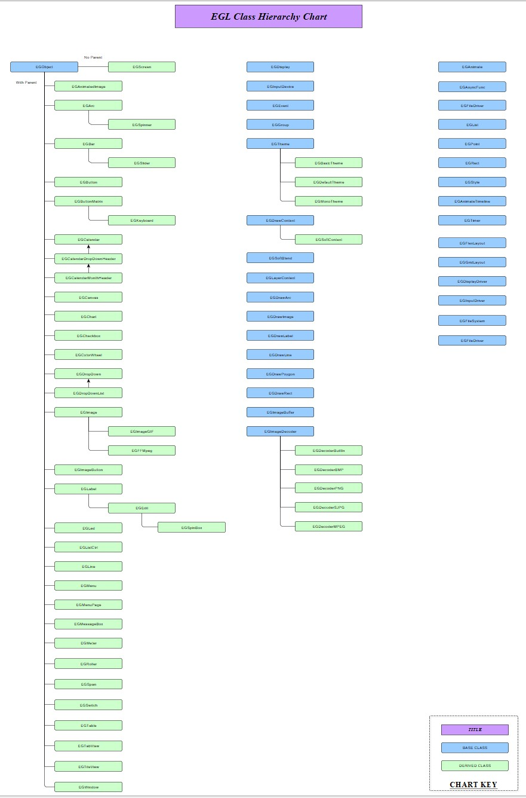

EGL (Embeded Graphics Library).
..........................

:Stable release:  v8.4.4.

:Status:  First release.

:Maintainer:  sjames@hydrasystems.com

:Description:  EGL is a reworking of LVGL in C++.

  This is a rewritten version of LVGL based on version 8.4.4. I chose to rename it to indicate that
  a large amount of the interface is different from that of LVGL and requires interpretaion from direct
  function calls 'Func(Obj, Arg)' to class calls 'Obj->Func(Arg). It is object based with a conventional
  class structure. I have adhered to the same function naming as LVGL as much as possible but using 
  'medial case' format.
  I have also expanded some of the ambiguous abbreviations for clarity and readability.

Key Features
============

    * Adhears to the same functionality as LVGL with the same UI.
    * Straight forward class convention and hierachy.
    * Easy to follow structure for debuging.
    * Redily extensable from either the base class (EGObject) or an existing widget class.

To Do
=====

    * Testing and confirmation on other platforms.

Known Issues
============

    * Only tested on the ESP32 platform.

Required Repositories
================

* None

Required Hardware
=================

* At the moment ESP32.

Note
=======

I use a tab size of 2 for all source code. Using anything else may look weird.

Support
=======

Problems can be reported using the issues tab in github.
